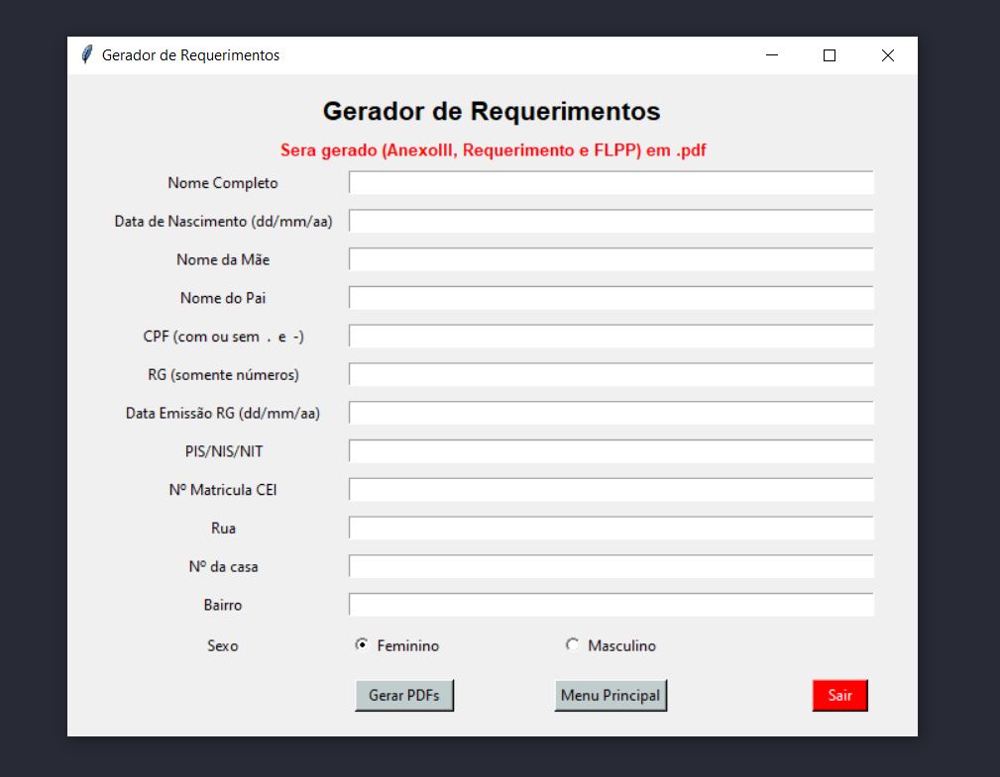

## Automação para sobrescrever e salvar arquivos .docx e PDFs interativos
### Objetivo
Auxiliar a mim e aos meus colegas de trabalho com tarefas repetitivas, onde manipulavamos arquivo word e pdfs interativos, preenchendo campos e salvando os arquivos com seus respectivos nomes.
### Como rodar
- pip install python-docx
- pip install fillpdf
- python main.py

### Após a execução
 - Sera gerado duas pastas "/declarações_geradas" e "/requerimentos_gerados"
 - Dentro dessas pastas irá conter os arquivos

### Telas

 
 
 
 

### Converter para executavel

 - pyinstaller --noconsole --name=myapp main.py
