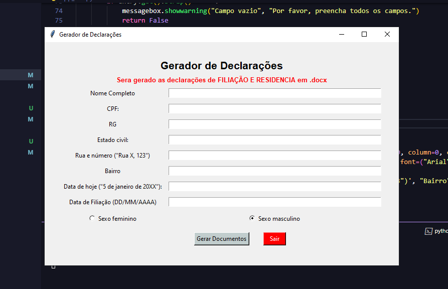
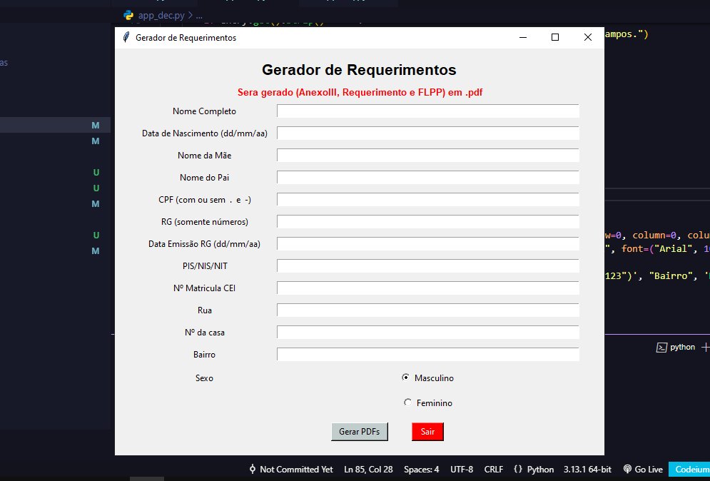

# **Automação de Preenchimento de Documentos - Descrição e Guia**

## **Visão Geral**

Este projeto automatiza o processo de preenchimento de formulários em documentos Word e PDF com os dados fornecidos por um usuário. A aplicação foi desenvolvida em Python e usa bibliotecas como `python-docx` e `fillpdf` para manipular documentos. O objetivo é otimizar o tempo gasto preenchendo os dados manualmente, reduzindo de 5 a 7 minutos para apenas alguns segundos por documento.

**Funcionalidades:**
- Preenchimento automático de dados em documentos Word e PDF.
- Interface gráfica para inserção de dados.
- Salvamento automático dos documentos gerados.

---

## **Tecnologias Utilizadas**

- **Python 3.x**
- **Bibliotecas:**
  - `python-docx`: Manipulação de documentos Word.
  - `fillpdf`: Preenchimento de campos em formulários PDF.
  - **Interface Gráfica**: [`Tkinter`]
- **Sistema Operacional**: [Windows/Linux/Mac]

---

## **Instalação e Requisitos**

### **Pré-requisitos**

- Instalar o Python 3
- Bibliotecas necessárias:
  ```bash
  pip install python-docx fillpdf
### **Instalando e Executando**

1. Clone o repositório:
   ```bash
   git clone https://github.com/lauanderson-rael/doc-generator.git
2. Acesse a pasta do projeto:
   ```bash
   cd doc-generator
3. Instale as Dependencias:
   ```bash
   pip install python-docx fillpdf
4. Abra o aplicativo executando o arquivo principal:
   ```bash
   python app.py
5. Converter para .exe (<span style="color: tomato;">Opcional</span>)
    ```bash
    pip install pyinstaller
     ```
    ```bash
    pyinstaller --noconsole --name=app app.py
     ```

### **Apos a execução**
 - A interface gráfica solicitará que você insira os dados do cliente.
 - Após o preenchimento, os documentos Word e PDF serão gerados automaticamente.
 - Os documentos preenchidos serão salvos na pasta de saída especificada, "/declarações_geradas" ou "/requerimentos_gerados"

### Telas do Sistema
<br><br>
<br><br>
<br><br>